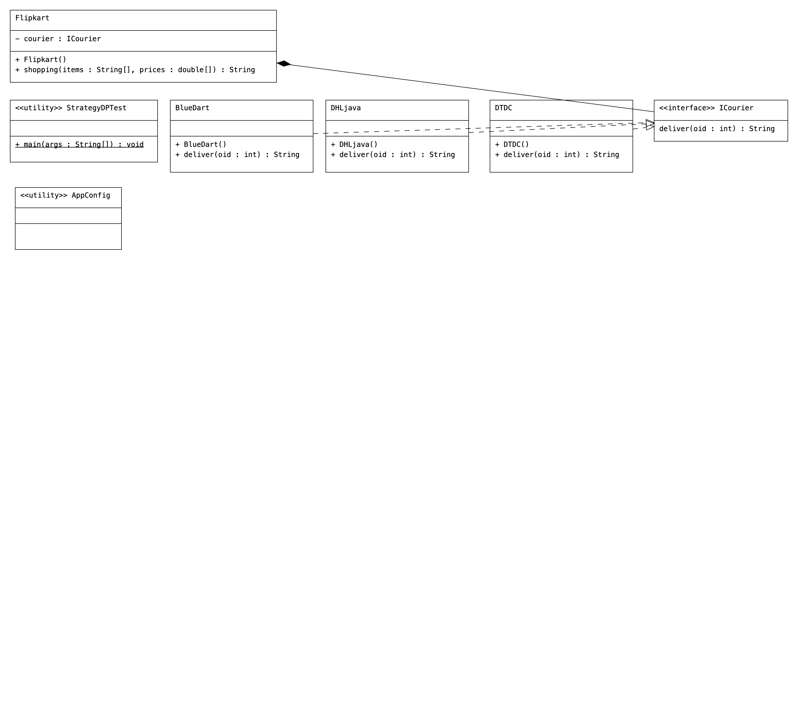

# iocproj05-strategydp-springcoremodule
 

# Code
```Java
//ICourier.java (Common Interface)
package com.courier.sbeans;

public interface ICourier {
   public  String deliver(int oid);
}
```
```Java
//StrategyDPTest.java (Client App)
package com.courier.client;


import org.springframework.context.annotation.AnnotationConfigApplicationContext;

import com.courier.config.AppConfig;
import com.courier.sbeans.Flipkart;

public class StrategyDPTest {

	public static void main(String[] args) {
	  //create the IOC container
		  AnnotationConfigApplicationContext ctx=
				    new  AnnotationConfigApplicationContext(AppConfig.class);
		  //get target spring bean class obj ref
		  Flipkart fpkt=ctx.getBean("fpkt",Flipkart.class);
		  //invoke the b.method
		  String resultMsg=fpkt.shopping(new String[] {"shirt","trouser"}, 
				                                                       new double[] {90000.0,50000.0});
		  System.out.println(resultMsg);
         //close the container
		    ctx.close();
	}

}
```
```Java
//AppConfig.java (Confguration class)
package com.courier.config;

import org.springframework.context.annotation.ComponentScan;
import org.springframework.context.annotation.Configuration;

@Configuration
@ComponentScan(basePackages = "com.nt.sbeans")
public class AppConfig {

}
```
```Java
//BlueDart.java (Dependency class1)
package com.courier.sbeans;

import org.springframework.context.annotation.Lazy;
import org.springframework.stereotype.Component;

@Component("bDart")
@Lazy(true)
public final class BlueDart implements ICourier {

	public BlueDart() {
		System.out.println("BlueDart:: 0-param constructor");
	}
	
	@Override
	public String deliver(int oid) {
		
		return "BlueDart courier is ready to deliver "+oid+" order number  products ";
				
	}

}
```
```Java
//DHL.java (depedent class3)
package com.courier.sbeans;

import org.springframework.context.annotation.Lazy;
import org.springframework.stereotype.Component;

@Component("courier")
@Lazy(true)
public final class DHLjava implements ICourier {

	public DHLjava() {
		System.out.println("DHL:: 0-param constructor");
	}
	
	@Override
	public String deliver(int oid) {
		
		return "DHL courier is ready to deliver "+oid+" order number  products ";
				
	}

}
```
```Java
//DTDC.java (depedent class2)
package com.courier.sbeans;

import org.springframework.context.annotation.Lazy;
import org.springframework.context.annotation.Primary;
import org.springframework.stereotype.Component;

@Component("dtdc")
@Lazy(true)
@Primary
public final class DTDC implements ICourier {

	public DTDC() {
		System.out.println("DTDC:: 0-param constructor");
	}
	
	@Override
	public String deliver(int oid) {
		
		return "DTDC courier is ready to deliver "+oid+" order number  products ";
				
	}

}
```
```Java
//Flipkart.java (target class)
package com.courier.sbeans;

import java.util.Arrays;
import java.util.Random;

import org.springframework.beans.factory.annotation.Autowired;
import org.springframework.beans.factory.annotation.Qualifier;
import org.springframework.stereotype.Component;

@Component("fpkt")
public final class Flipkart {
	//HAS- property
	@Autowired
	@Qualifier("bDart")
  private ICourier courier;
  
  public Flipkart() {
	System.out.println("Flipkart:: 0-param constructor");
}

  //b.method
  public  String shopping(String  items[], double prices[] ) {
	  System.out.println("Flipkart.shopping()");
	  //calculate bill amount
	  double billAmt=0.0;
	  for(double p:prices) {
		  billAmt=billAmt+p;
	  }
	  //generate order id randomly
	   int oid=new Random().nextInt(100000);
	  // deliver the order using couier
	  	  String msg=courier.deliver(oid);
	  return Arrays.toString(items)+"are shopped having bill amount::"+billAmt+" --->"+msg;
  }
}
```
# POM
```xml
  <dependencies>
        <dependency>
            <groupId>org.springframework.boot</groupId>
            <artifactId>spring-boot-starter-web</artifactId>
        </dependency>

        <dependency>
            <groupId>org.projectlombok</groupId>
            <artifactId>lombok</artifactId>
            <optional>true</optional>
        </dependency>
        <dependency>
            <groupId>org.springframework.boot</groupId>
            <artifactId>spring-boot-starter-tomcat</artifactId>
            <scope>provided</scope>
        </dependency>
        <dependency>
            <groupId>org.springframework.boot</groupId>
            <artifactId>spring-boot-starter-test</artifactId>
            <scope>test</scope>
        </dependency>
    </dependencies>
```

# UML
